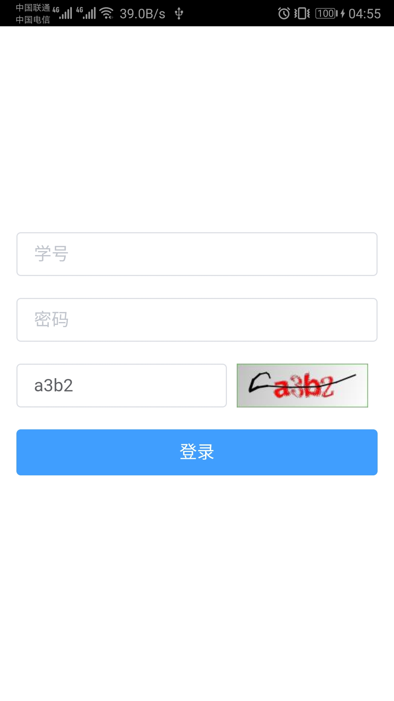
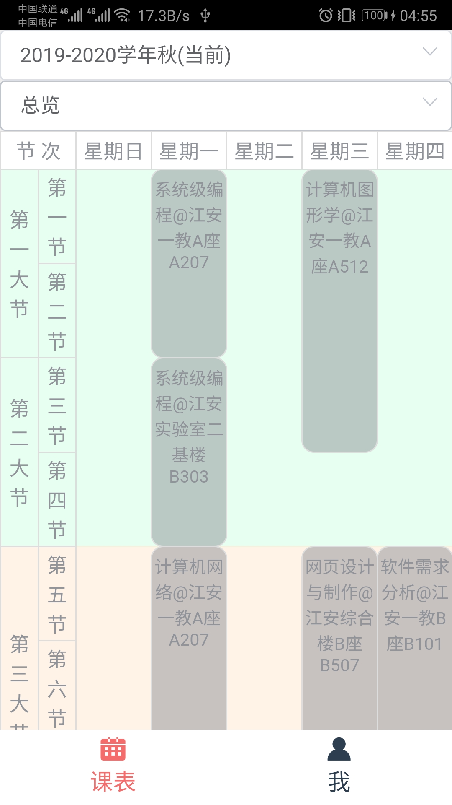
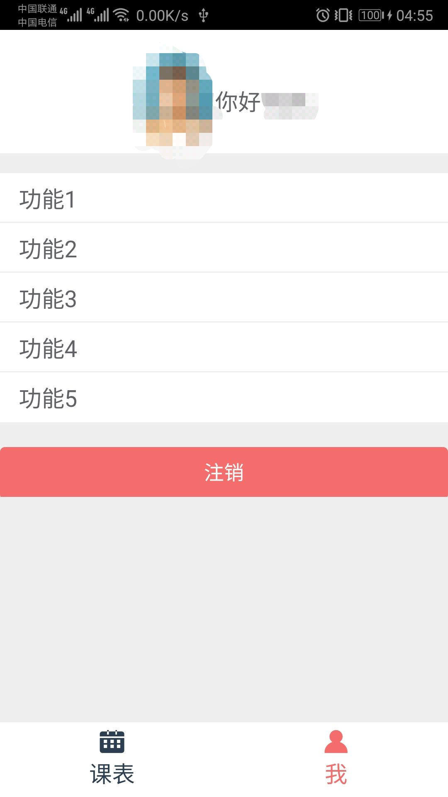

# SCUEnquiry_H5
使用cordova + vue 重构的项目[SCUEnquiry](https://github.com/wuuuudle/SCUEnquiry)。原项目现不再维护。

# 运行

## 安装 Cordova
```
npm install -g cordova
```

## 加载node_modules
根目录与vue-app目录分别执行
```
npm install
```

## 载入
在vue-app目录执行
```
npm run build
```
在根目录执行
```
cordova prepare
```
android studio载入目录 /platforms/andoird 的项目即可。

# 运行截图
## 登录
自动填写验证码，本地使用sqlite保存学号和密码。启动时先尝试缓存登录。待添加：自动登录。

## 课表
可查看历年课表，可查看某周的课表

## 设置
一张你大大的证件照与你的名字。
